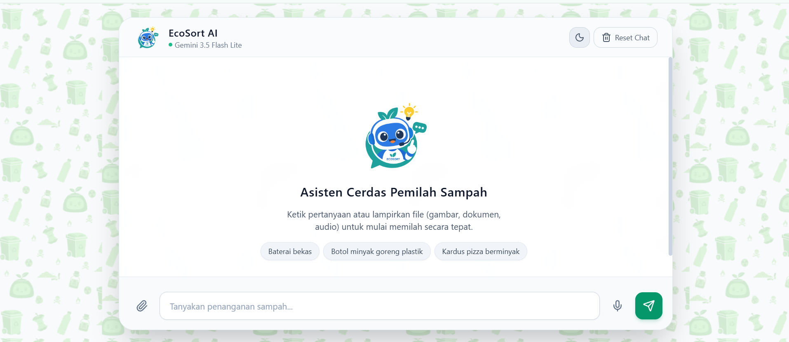

<div align="center">

[](https://github.com/Humble011/ecosort-hacktiv8/graphs/contributors)
[](https://github.com/Humble011/ecosort-hacktiv8/network/members)
[](https://github.com/Humble011/ecosort-hacktiv8/stargazers)
[](https://github.com/Humble011/ecosort-hacktiv8/issues)
[](LICENSE)
<br />

<a href="https://github.com/Humble011/ecosort-hacktiv8">
  
</a>

<h2 align="center">EcoSort AI</h2>

<p align="center">
  Smart Multimodal Waste Sorting Assistant powered by Gemini 3.5 Flash Lite
  <br />
  <a href="https://ecosort-hacktiv8.vercel.app/"><strong>View Demo »</strong></a>
  <br />
  <br />
  <a href="https://ecosort-hacktiv8.vercel.app/">Explore the App</a>
  ·
  <a href="https://github.com/Humble011/ecosort-hacktiv8/issues">Report Bug</a>
  ·
  <a href="https://github.com/Humble011/ecosort-hacktiv8/issues">Request Feature</a>
</p>

</div>

<details>
  <summary>Table of Contents</summary>
  <ol>
    <li><a href="#about-the-project">About The Project</a></li>
    <li><a href="#built-with">Built With</a></li>
    <li><a href="#key-features">Key Features</a></li>
    <li><a href="#getting-started">Getting Started</a></li>
    <li><a href="#license">License</a></li>
  </ol>
</details>

---

## About The Project

EcoSort AI is a web-based intelligent assistant designed to help users identify, sort, and manage household waste responsibly and sustainably. Powered by the multimodal capabilities of **Gemini 3.5 Flash Lite**, the application analyzes text queries, physical item photos, waste inventory documents, and direct voice recordings within the browser.

<p align="center">
  
</p>

---

## Built With

* [](https://developer.mozilla.org/en-US/docs/Web/JavaScript)
* [](https://developer.mozilla.org/en-US/docs/Web/HTML)
* [](https://tailwindcss.com/)
* [](https://nodejs.org/)
* [](https://expressjs.com/)
* [](https://ai.google.dev/)
* [](https://vercel.com/)

---

## Key Features

* **Comprehensive Multimodal Input:**
  * **Text:** Ask interactive questions regarding waste classification, material types, and recycling methods.
  * **Images:** Instant visual identification of physical waste items (`JPG`, `PNG`, `WebP`).
  * **Documents:** Analyze waste inventory records and reports from files (`PDF`, `TXT`, `CSV`).
  * **Direct Audio:** In-browser voice recording (`audio/webm`) processed natively by Gemini API without external transcription layers.
* **Structured Classification:** Categorizes waste items into standard streams (Organic, Inorganic, Hazardous/E-Waste, Residual) with pre-disposal handling steps and disposal channel recommendations.
* **Persistent Chat Sessions:** Utilizes HTML5 LocalStorage to maintain active conversation history across page reloads.
* **Responsive & Adaptive UI:** Mobile-first, cross-platform interface supporting both Light Mode and Dark Mode.

---

## Getting Started

### Prerequisites

Ensure the following tools are installed on your local environment:
* [Node.js](https://nodejs.org/) (version 18 or later)
* npm (Node Package Manager)
* An API Key from [Google AI Studio](https://aistudio.google.com/)

### Installation

1. **Clone the repository:**
   ```bash
   git clone [https://github.com/Humble011/ecosort-hacktiv8.git](https://github.com/Humble011/ecosort-hacktiv8.git)
   cd ecosort-hacktiv8
2. **Install dependencies:**
      ```bash
    npm install
3. **Configure environment variables:**
   Create a .env file the root directory:
      ```bash
    GEMINI_API_KEY=your_gemini_api_key_here
    PORT=3000
4. **Run the local server:**
   ```bash
   npm start
Open http://localhost:3000 in your web browser.


## License

This project is licensed under the **MIT License** — see the [LICENSE](LICENSE) file for full legal details.

```text
Permissions:
✔ Commercial use
✔ Modification
✔ Distribution
✔ Private use

Conditions:
ℹ License and copyright notice must be included in all copies.
```

This project was developed as a Final Project submission for the Hacktiv8 "Maju Bareng AI for IT Professional" program.


